# ARIA

**Anatomy aware Radiomorphometric Index Annotator**

An installable desktop application for annotating dental panoramic radiographs
and producing machine readable mandibular radiomorphometric data. Windows and
macOS.

ARIA is an annotation and research data tool. It does not diagnose
osteoporosis, it does not estimate bone mineral density, and it does not
recommend treatment.

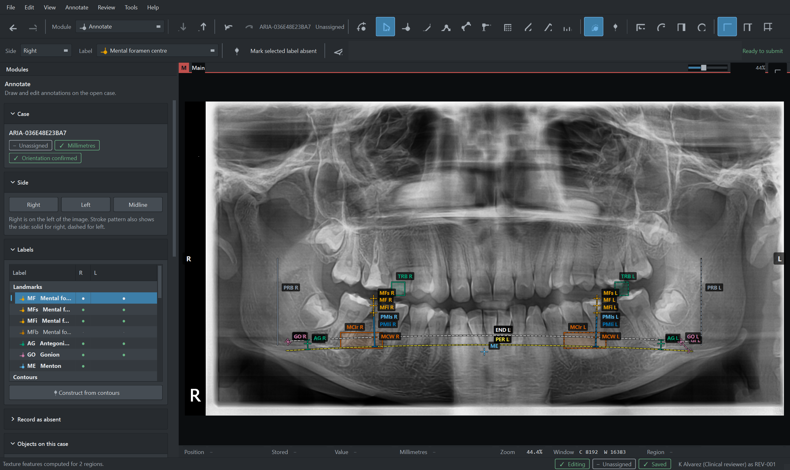

> **New here? Read the [user guide](docs/USER_GUIDE.md).** It walks through a
> whole case from import to export, in the order the work is actually done.

---

## Contents

* [What it does](#what-it-does)
* [A look around](#a-look-around) — screenshots of every module
* [Install and run](#install-and-run)
* [Documentation](#documentation)
* [Testing](#testing)
* [Design points worth knowing](#design-points-worth-knowing)
* [Repository layout](#repository-layout)

---

## What it does

* Reads **DICOM Part 10** and **PNG**, retains the original file unchanged and
  links every annotation to those exact bytes by checksum.
* Records **landmarks, contours, regions, index lines, grades, quality flags**
  and their provenance, per anatomical side.
* Computes **mandibular cortical width, the panoramic mandibular index,
  antegonial index and gonial index**, each carrying the identifiers of the
  annotations it came from and the version of the rules that produced it.
* Computes **texture features** after annotation: co-occurrence, fractal
  dimension, local binary patterns and run length, with every parameter recorded.
* Supports **blinded duplicate annotation** and reports agreement without
  imposing a pass mark.
* Exports **JSON, CSV with a data dictionary, indexed PNG masks, COCO
  segmentation** and, once interoperability is accepted, **DICOM SR and
  Segmentation**.
* Produces a **training bundle**: one verifiable archive holding raw images,
  labels, derived measurements and a metadata sheet.

Everything runs on the workstation. There is no network layer and no model.

---

## A look around

### First launch

Before anything else, ARIA checks whether this workstation can do the work:
processor, memory, free space, storage durability, encryption and image
preparation speed, each with the requirement it was measured against and what to
do when it is not met.

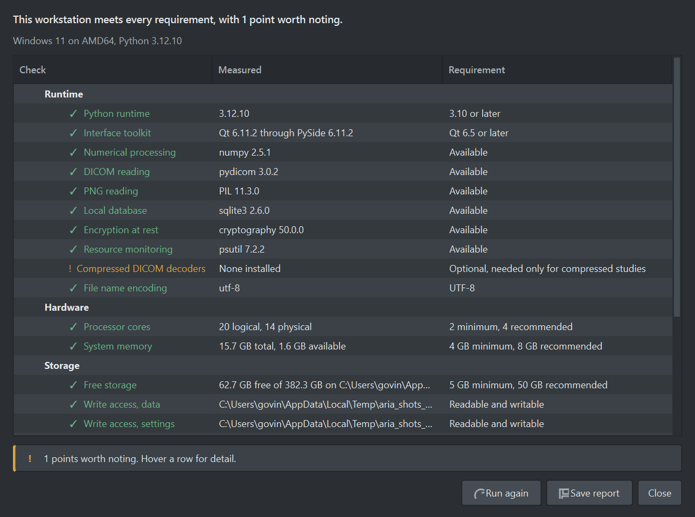

A two minute guided tour then points at the real controls. It can be skipped and
re-run at any time from Help.

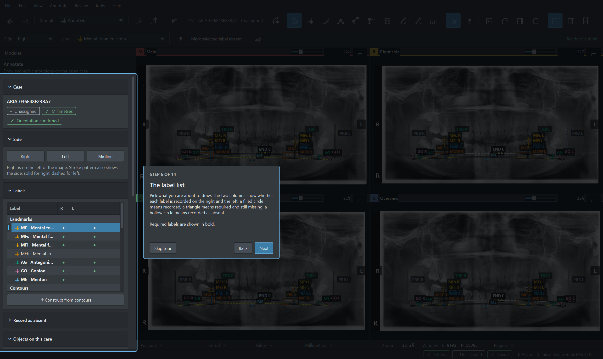

### Cases

Cases are listed with their workflow state shown as both a symbol and a word,
never as a colour alone. The Calibration column says at a glance whether
millimetre values are available.

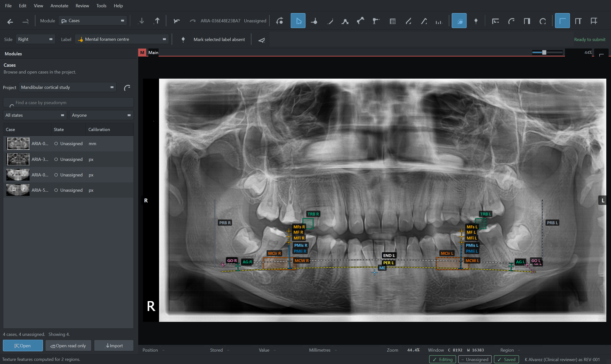

### Annotating

The label list shows completion per side: a filled circle means recorded, a
triangle means required and still missing, a hollow circle means recorded as
absent. Right is drawn with a solid stroke and left with a dashed one, so the
sides are distinguishable without relying on colour.

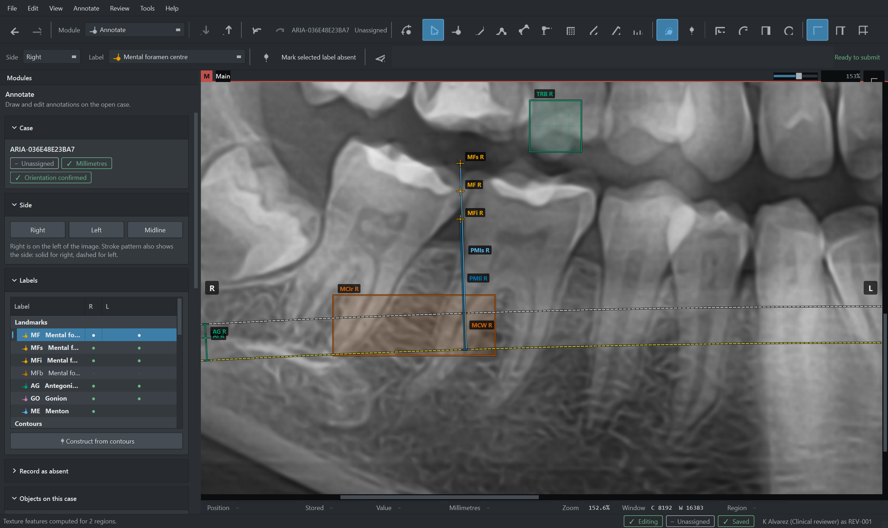

Once the contours and the mental foramen are placed, **Construct from contours**
computes the index line the protocol defines. It is deterministic geometry from
your own contours, it states how it was built, and the result is editable.

### Measurements and calibration

Every quantitative result is shown with its calibration source, value, unit,
validation status and correction factor. Millimetre values appear only from a
validated calibration; otherwise you get pixels and dimensionless ratios, and
the millimetre column says unavailable rather than guessing.

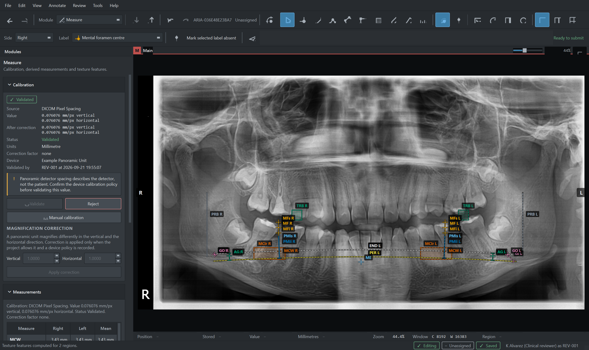

Note the warning: a panoramic unit magnifies differently in the vertical and the
horizontal direction, so detector spacing from the DICOM header is not
anatomical scale. Magnification correction stays off until a device policy is
approved.

### Four pane layout

The whole image with a magnified right side, a magnified left side and an
overview.

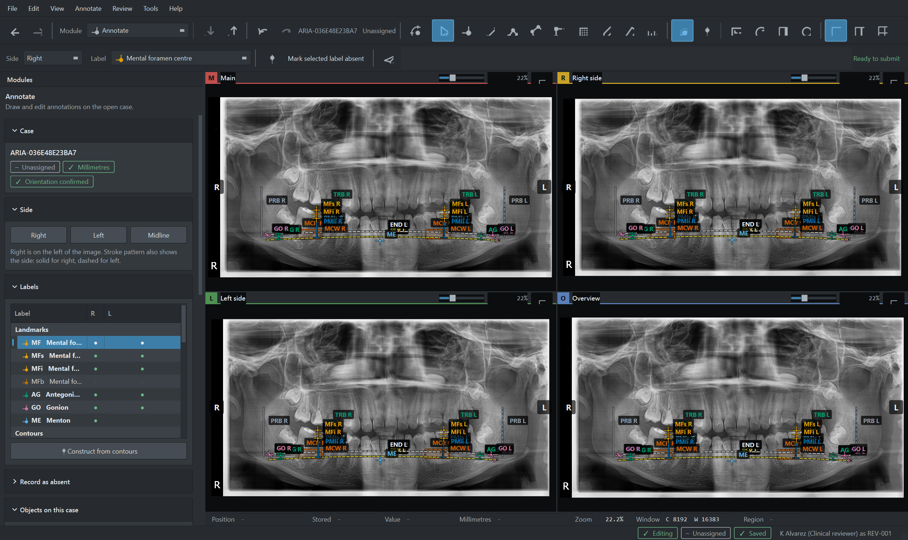

### Review and agreement

Compare revisions, comment on individual labels, and accept, return or
adjudicate. A returned case keeps its prior submission and later edits become a
new revision.

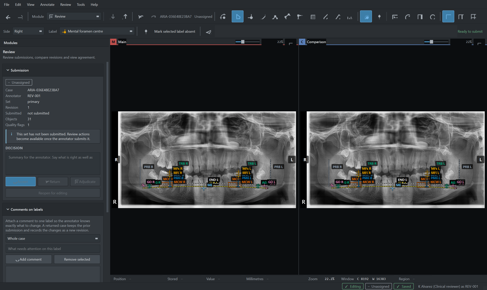

### Export

Filter by state, split and annotator, then write JSON, CSV, masks, COCO or a
training bundle. Every record is scanned for direct identifiers before anything
is written.

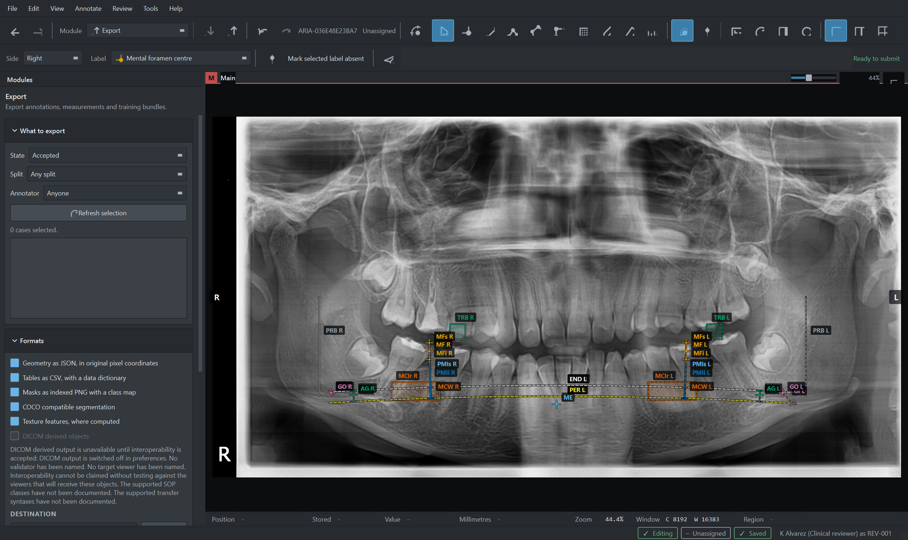

### Administration

Projects, label schema, tolerances, accounts, privacy profile, screening
thresholds and the decisions that need clinical sign off, each with its current
state.

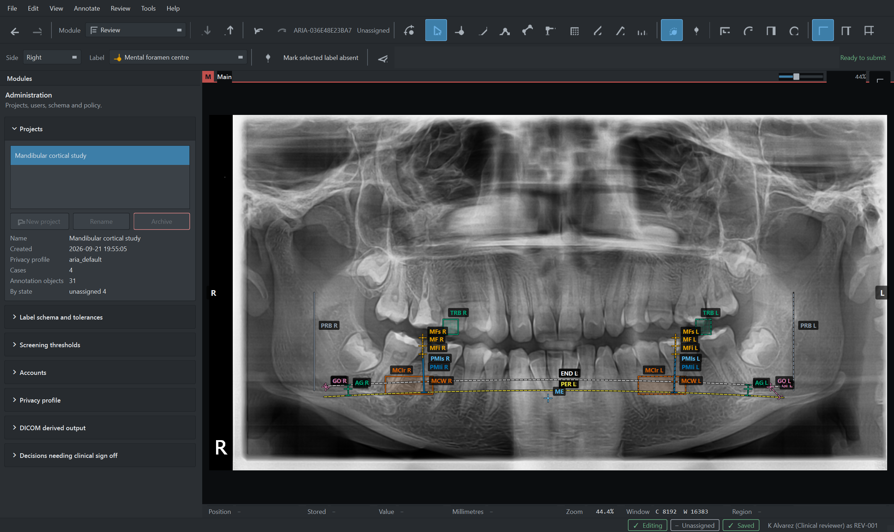

### Audit

Every change, with the actor, the object and the before and after values. Each
record carries the digest of the one before it, so tampering is detectable
rather than merely discouraged.

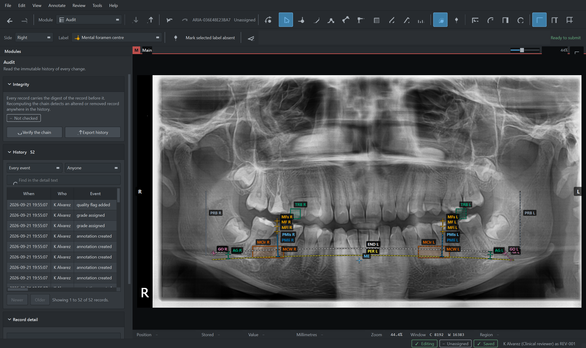

### Diagnostics

The self tests run against the installed code and say what each one checked.

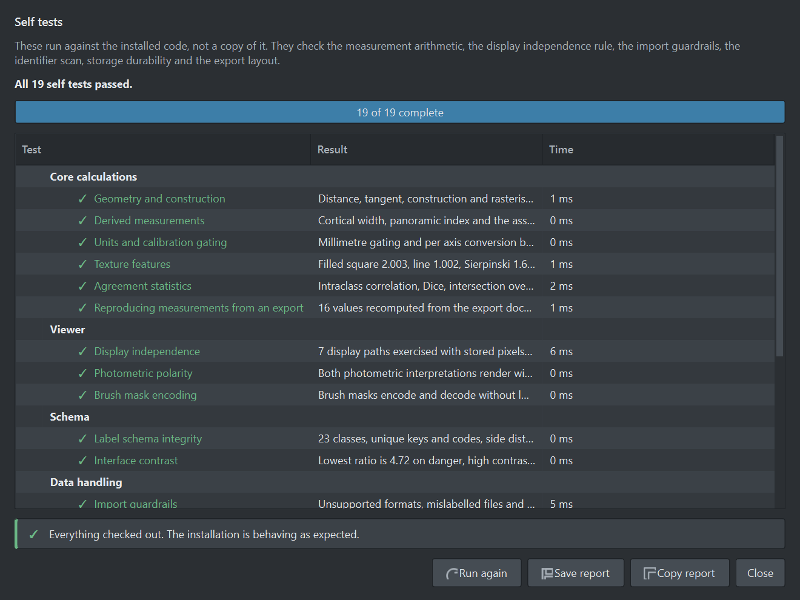

### Preferences and shortcuts

| | |
| --- | --- |
| 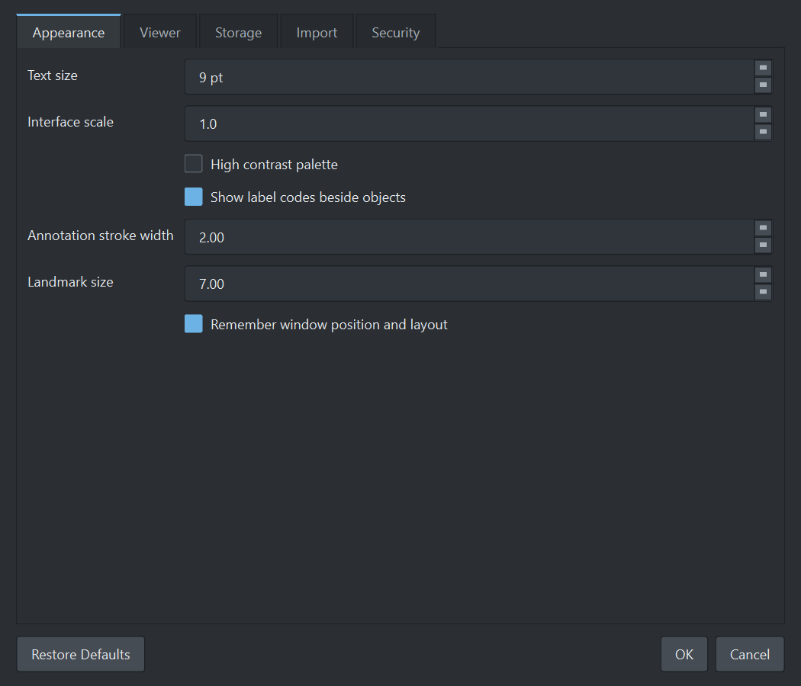 | 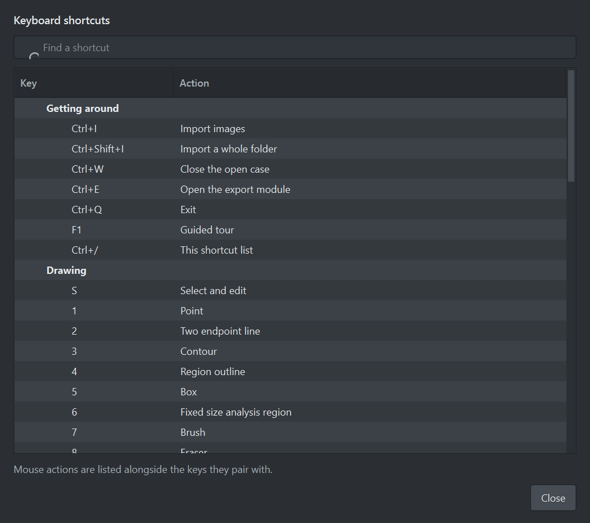 |
| Appearance, viewer, storage, import limits and security policy | Every shortcut, grouped by what you are doing |

---

## Install and run

### Sample images

`Test Artifacts/` holds four panoramic radiographs the test suite and the
interface smoke run use. Their **pixel data is real and unchanged**; every
identifier, date, device value and patient characteristic in them was replaced
with a fabricated one before publication, so they exercise every code path
while leading nowhere if followed. See
[Test Artifacts/README.md](Test%20Artifacts/README.md) and
`scripts/sanitise_fixtures.py`.

The fixtures are optional. Tests that need them skip cleanly when the folder is
absent, so you can drop in your own images instead.

### From source

```bash
python -m pip install -e .
python -m aria
```

Python 3.10 or later. Windows 10 or later, or macOS 11 or later.

The first launch checks the workstation, creates an administrator account and a
project, then offers the guided tour.

### Building an installable application

**Windows**

```powershell
powershell -ExecutionPolicy Bypass -File packaging\build_windows.ps1
```

Produces `dist\ARIA\` and, when Inno Setup is installed, an installer in
`dist\installer\`.

**macOS**

```bash
bash packaging/build_macos.sh --sign "Developer ID Application: Name (TEAMID)"
```

Produces `dist/ARIA.app` and a disk image. Add `--notarize PROFILE` to notarise
and staple.

Both scripts build in a clean virtual environment, run the test suite, stop on
failure, and run the packaged binary's own self tests before producing an
installer. See [packaging/README.md](packaging/README.md) for signing and
notarisation.

### Checking a build without the interface

```bash
aria --self-test          # run the self tests
aria --system-check       # check this workstation
aria --verify-bundle PATH # verify a training bundle
aria --verify-audit       # verify the audit chain
aria --version            # print every version identifier
```

Add `--json` for machine readable output.

---

## Documentation

| Document | Written for |
| --- | --- |
| **[User guide](docs/USER_GUIDE.md)** | **Annotators, reviewers and administrators. Start here.** |
| [Architecture](docs/ARCHITECTURE.md) | Engineers joining or reviewing the project |
| [Requirements traceability](docs/REQUIREMENTS_TRACEABILITY.md) | Clinical and implementation teams reviewing against the specification |
| [Colour and label nomenclature](docs/COLOUR_NOMENCLATURE.md) | Annotators, and anyone reading an export |
| [Data dictionary](docs/DATA_DICTIONARY.md) | Anyone reading an export without the application |
| [Packaging](packaging/README.md) | Whoever produces the installers |

The colour nomenclature and the data dictionary are generated from the code by
`python scripts/make_docs.py`, so they cannot drift from what the application
actually does.

### The user guide covers

Importing · calibration and units · annotating a case in the order the work is
done · recording what is absent · grading the cortex · quality flags · texture
features · submitting · reviewing · agreement · exporting · administration ·
keeping work safe · what to do when something goes wrong.

---

## Testing

```bash
pytest tests -q                       # everything, 120 tests
pytest tests/test_acceptance.py -v    # the specification's acceptance criteria
pytest tests/test_startup.py -v       # the real application startup path
pytest -m smoke                       # the fast self tests
python scripts/ui_smoke.py            # drive the real interface offscreen
```

`tests/test_acceptance.py` is section 11 of the specification written as
executable tests, one group per criterion.

`tests/test_startup.py` drives `aria.app.run` itself, including first run, sign
in and the cancel paths, and statically scans for Qt enum members read from an
instance rather than a class.

`scripts/ui_smoke.py` builds the actual main window, imports the sample images,
draws a full annotation set, constructs every index line, grades, submits,
reviews, exports and builds a bundle, all offscreen.

---

## Design points worth knowing

**Display changes cannot move a coordinate.** The graphics scene *is* the image
pixel coordinate system: one scene unit is one image pixel. Zoom and pan act on
the view transform only. That is structural, not a rule the code has to
remember.

**Millimetres are gated, ratios are not.** A millimetre value is produced only
from a validated calibration. A dimensionless ratio such as the panoramic
mandibular index is produced regardless, and the basis used is recorded on the
value.

**Detector spacing is not anatomical scale.** A panoramic unit magnifies
differently in the vertical and the horizontal direction, so the detector scale
and the magnification correction are separate fields, and the correction is
refused unless the project has approved a device policy.

**Absence is a state, not a coordinate.** A structure that cannot be annotated
carries a presence state and a reason. Nothing downstream can read it as a
measurement at the origin.

**Geometry assists are not predictions.** Constructing the cortical width line
is deterministic geometry from the annotator's own contours. It says how it was
built, it is editable, and the object records that it began as a construction.

**History is append only at the storage layer.** Database triggers reject every
update and delete on the audit and revision tables, and each audit record
carries the digest of the one before it.

**Roles are least privilege.** A project administrator manages projects,
schemas, accounts and policy; annotation is the annotator's and the reviewer's
work. An auditor reads history and never sees editable clinical content.

---

## Repository layout

```
aria/
  core/        domain logic, no Qt and no database
  io/          readers, guards, deidentification, exporters
  store/       SQLite schema and the repository
  security/    accounts, permissions, encryption at rest
  platform/    compatibility check and self tests
  ui/          the interface
tests/         acceptance, functional, startup and smoke tests
scripts/       interface smoke run, screenshots, icons, docs
packaging/     PyInstaller spec, build scripts, installer
docs/          documentation and screenshots
```
